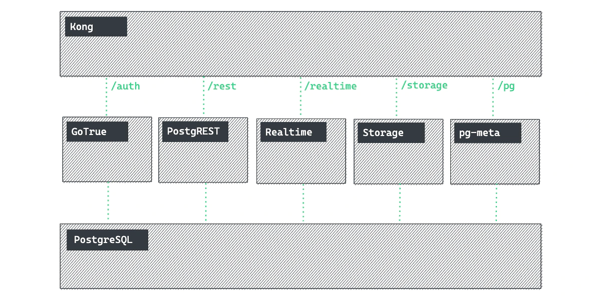

# Helicone Helm Chart

Launch a self-hosted [Helicone](https://www.helicone.ai/) chart. 

## Architecture 

Helicone is built on top of [Supabase](https://supabase.com) (an open source Firebase alternative). 


<span style="font-size: smaller;"><center><em>Helicone's underlying Supabase Infrastructure (functions and imgproxy components not shown)</em></center></span>

The Helicone components of the build are:

* helicone/web: Helicone's UI
* helicone/worker: The proxy that apps will send requests to
* clickhouse: an open source columnar analytics DB ([documentation](https://clickhouse.com/))

### Disclamer

We use [supabase/postgres](https://hub.docker.com/r/supabase/postgres) to create and manage the Postgres database. This permits you to use replication if needed but you'll have to use the Postgres image provided Supabase or build your own on top of it. You can also choose to use other databases provider like [StackGres](https://stackgres.io/) or [Postgres Operator](https://github.com/zalando/postgres-operator). Note that managed databases like RDS are not currently supported as they do not support [several required Supabase extensions](https://github.com/supabase-community/supabase-on-aws/issues?q=is:issue+pg+).

For the moment we are using a root container to permit the installation of the missing `pgjwt` and `wal2json` extension inside the `initdbScripts`. This is considered a security issue, but you can use your own Postgres image instead with the extension already installed to prevent this. Supabase provides an example of `Dockerfile` for this purpose, you can use [ours](https://hub.docker.com/r/tdeoliv/supabase-bitnami-postgres) or build and host it on your own.

The database configuration we provide is an example using only one master. If you want to go to production, we highly recommend you to use a replicated database.

## Quickstart

> For this section we're using Minikube and Docker to create a Kubernetes cluster

> The `ANON_KEY`, `JWT_SECRET`, and `SERVICE_ROLE_KEY` (under the `supabase` vault entry) were generated using the API KEYS tool at [supabase.com/docs/guides/self-hosting](https://supabase.com/docs/guides/self-hosting).

```bash
# Clone Repository
git clone https://github.com/helicone/helicone-helm-chart

# Switch to charts directory
cd /helicone-helm-chart/helm/helicone

# Create Supabase JWT-based secrets
kubectl -n default create secret generic helicone-supabase \
  --from-literal=ANON_KEY='eyJhbGciOiJIUzI1NiIsInR5cCI6IkpXVCJ9.ewogICAgInJvbGUiOiAiYW5vbiIsCiAgICAiaXNzIjogInN1cGFiYXNlIiwKICAgICJpYXQiOiAxNjc1NDAwNDAwLAogICAgImV4cCI6IDE4MzMxNjY4MDAKfQ.ztuiBzjaVoFHmoljUXWmnuDN6QU2WgJICeqwyzyZO88' \
  --from-literal=SERVICE_ROLE_KEY='eyJhbGciOiJIUzI1NiIsInR5cCI6IkpXVCJ9.ewogICAgInJvbGUiOiAic2VydmljZV9yb2xlIiwKICAgICJpc3MiOiAic3VwYWJhc2UiLAogICAgImlhdCI6IDE2NzU0MDA0MDAsCiAgICAiZXhwIjogMTgzMzE2NjgwMAp9.qNsmXzz4tG7eqJPh1Y58DbtIlJBauwpqx39UF-MwM8k' \
  --from-literal=JWT_SECRET='abcdefghijklmnopqrstuvwxyz123456'

# Create SMTP secret
kubectl -n default create secret generic helicone-smtp \
  --from-literal=SMTP_USERNAME='your-mail@example.com' \
  --from-literal=SMTP_PASSWORD='example123456'

# Create postgres secret
kubectl -n default create secret generic helicone-postgres \
  --from-literal=POSTGRES_USER='postgres' \
  --from-literal=POSTGRES_PASSWORD='example123456' 

# Create clickhouse secret
kubectl -n default create secret generic helicone-clickhouse \
  --from-literal=CLICKHOUSE_USER='default' \
  --from-literal=CLICKHOUSE_PASSWORD='default' 

# Install the chart
helm -n default install helicone -f values.example.yaml .
```

The first deployment can take some time to complete (especially auth service). You can view the status of the pods using:

```bash
k get pods -n default 

NAME                                                 READY   STATUS    RESTARTS   AGE
helicone-helicone-auth-547598f79f-rmz5w              1/1     Running   0          45s
helicone-helicone-clickhouse-6788f7f8db-5rzm4        1/1     Running   0          45s
helicone-helicone-db-58cdcbd846-bsv9t                1/1     Running   0          45s
helicone-helicone-functions-779d46964-ztvmc          1/1     Running   0          45s
helicone-helicone-helicone-web-766c5b47c-9xjx7       1/1     Running   0          45s
helicone-helicone-helicone-worker-84978c8c8b-nznnl   1/1     Running   0          45s
helicone-helicone-imgproxy-59bf8f64b9-h479n          1/1     Running   0          45s
helicone-helicone-kong-7df4bf4f74-z6kfp              1/1     Running   0          45s
helicone-helicone-meta-7fc4bb6ff9-mxs7c              1/1     Running   0          45s
helicone-helicone-realtime-74449ff776-4xm9t          1/1     Running   0          45s
helicone-helicone-rest-645b58894b-6nqld              1/1     Running   0          45s
helicone-helicone-storage-76f6879895-8cxwb           1/1     Running   0          45s
helicone-helicone-studio-7b6756bd69-wfzkx            1/1     Running   0          45s
```

### Tunnel with Minikube

When the installation will be complete you'll be able to create a tunnel using minikube:

```bash
# First, enable the ingress addon in Minikube
minikube addons enable ingress

# Then enable the tunnel (will need sudo credentials because you are opening Port 80/443 on your local machine)
minikube tunnel
```

If you just use the `value.example.yaml` file, you can access the API or the Studio App using the following endpoints:

- <http://api.localhost>
- <http://studio.localhost>

### Uninstall

```Bash
# Uninstall Helm chart
helm -n default uninstall helicone 

# Delete secrets
kubectl -n default delete secret helicone-supabase
kubectl -n default delete secret helicone-smtp
kubectl -n default delete secret helicone-postgres
kubectl -n default delete secret helicone-clickhouse
```

## Customize

You should consider to adjust the following values in `values.yaml`:

- `JWT_SECRET_NAME`: Reference to Kubernetes secret with JWT secret data `secret`, `anonKey` & `serviceKey`
- `SMTP_SECRET_NAME`: Reference to Kubernetes secret with SMTP credentials `username` & `password`
- `DB_SECRET_NAME`: Reference to Kubernetes secret with Postgres credentials `username` & `password`
- `RELEASE_NAME`: Name used for helm release
- `NAMESPACE`: Namespace used for the helm release
- `API.EXAMPLE.COM` URL to Kong API
- `STUDIO.EXAMPLE.COM` URL to Studio

If you want to use mail, consider to adjust the following values in `values.yaml`:

- `SMTP_ADMIN_MAIL`
- `SMTP_HOST`
- `SMTP_PORT`
- `SMTP_SENDER_NAME`

### JWT Secret

We encourage you to use your own JWT keys by generating a new Kubernetes secret and reference it in `values.yaml`:

```yaml
  jwt:
    secretName: "JWT_SECRET_NAME"
```

The secret can be created with kubectl via command-line:

```bash
kubectl -n NAMESPACE create secret generic JWT_SECRET_NAME \
  --from-literal=secret='JWT_TOKEN_AT_LEAST_32_CHARACTERS_LONG' \
  --from-literal=anonKey='JWT_ANON_KEY' \
  --from-literal=serviceKey='JWT_SERVICE_KEY'
```

> 32 characters long secret can be generated with `openssl rand 64 | base64`
> You can use the [JWT Tool](https://supabase.com/docs/guides/hosting/overview#api-keys) to generate anon and service keys.

### SMTP Secret

Connection credentials for the SMTP mail server will also be provided via Kubernetes secret referenced in `values.yaml`:

```yaml
  smtp:
    secretName: "SMTP_SECRET_NAME"
```

The secret can be created with kubectl via command-line:

```bash
kubectl -n NAMESPACE create secret generic SMTP_SECRET_NAME \
  --from-literal=username='SMTP_USER' \
  --from-literal=password='SMTP_PASSWORD'
```

### DB Secret

DB credentials will also be stored in a Kubernetes secret and referenced in `values.yaml`:

```yaml
  db:
    secretName: "DB_SECRET_NAME"
```

The secret can be created with kubectl via command-line:

```bash
kubectl -n NAMESPACE create secret generic DB_SECRET_NAME \
  --from-literal=username='DB_USER' \
  --from-literal=password='PW_USER'
```

> If you depend on database providers like [StackGres](https://stackgres.io/) or [Postgres Operator](https://github.com/zalando/postgres-operator) you only need to reference the already existing secret in `values.yaml`.

## How to use in Production

We didn't provide a complete configuration to go production because of the multiple possibility.

But here are the important points you have to think about:

- Use a replicated version of the Postgres database.
- Add SSL to the Postgres database.
- Add SSL configuration to the ingresses endpoints using either the `cert-manager` or a LoadBalancer provider.
- Change the domain used in the ingresses endpoints.
- Generate a new secure JWT Secret.

## Troubleshooting

### Ingress Controller and Ingress Class

Depending on your Kubernetes version you might want to fill the `className` property instead of the `kubernetes.io/ingress.class` annotations. For example:

```yml
kong:
  ingress:
    enabled: 'true'
    className: "nginx"
    annotations:
      nginx.ingress.kubernetes.io/rewrite-target: /
```

